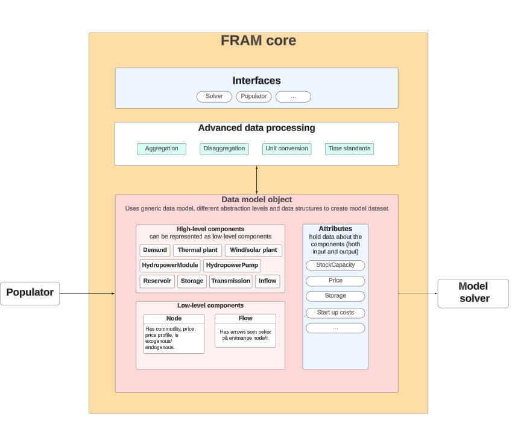

# Overview
FRAM core package is the central package in [FRAM]({{ framlinks.fram }}){:target="_blank"} that contains functionality for data transformation and definitions of interfaces. 

Power market models access data through FRAM **core model** - a model object that holds the data. Core model uses generic data structures and different abstraction levels to perform advanced data manipulations like aggregation, dissaggregation, handling time resolution, unit conversion etc.

To install only core package, run `pip install fram-core`. But we recommend that you rather start by installing our [simple demo]({{ framlinks.demo }}){:target="_blank"}.

## Core model
The core model object is populated with the data from the database using Populator. Core model represents data as expressions and uses "lazy" approach, i.e. the calculations are not done immediately but are postponed until Expr.evaluate() is called. This approcah gives a much better performance when processing large data quantities. Data processing expressions are saved inside the components of the core model.  

## Core model components
Core model contains **high-level** and **low-level** components.

### High-level components
High-level components are "recognizable" components such as thermal power plants, consumers, transmission lines. They can be "decomposed" into low-level components.

### Low-level components
Low-level components are the most basic components that can be used to represent the high-level components - **node** and **flow**. They can describe anything in the power market model. For example, transmission is a node that has two flow arrows, while demand is a node that has only one "incoming" flow arrow.

The advantage of decomposing high-level components into flow and node is that you can create generic algorithms with minimal code to manipulate the data and avoid duplicating code for similar operations. For example, you can write one generic function to find all hydropower plants or storage systems or to calculate yearly production, demand, export or import. 

## Interfaces
FRAM core package contains definition of interfaces necessary to run FRAM.

- **Populator**

Abstract class that defines methods that must be implemented in a populator. [FRAM data]({{ framlinks.data }}){:target="_blank"} package contains our own implementation of populator that supports our database format. If you want to use your own database, you can write your own implementation of populator based on this interface.

- **Solver**

Abstract class that defines methods that must be implemented in a model solver. [FRAM JulES]({{ framlinks.julesAPI }}){:target="_blank"} package contains our implementation of a solver for JulES power market model. Each market model is connected to FRAM using its own solver implementation. 